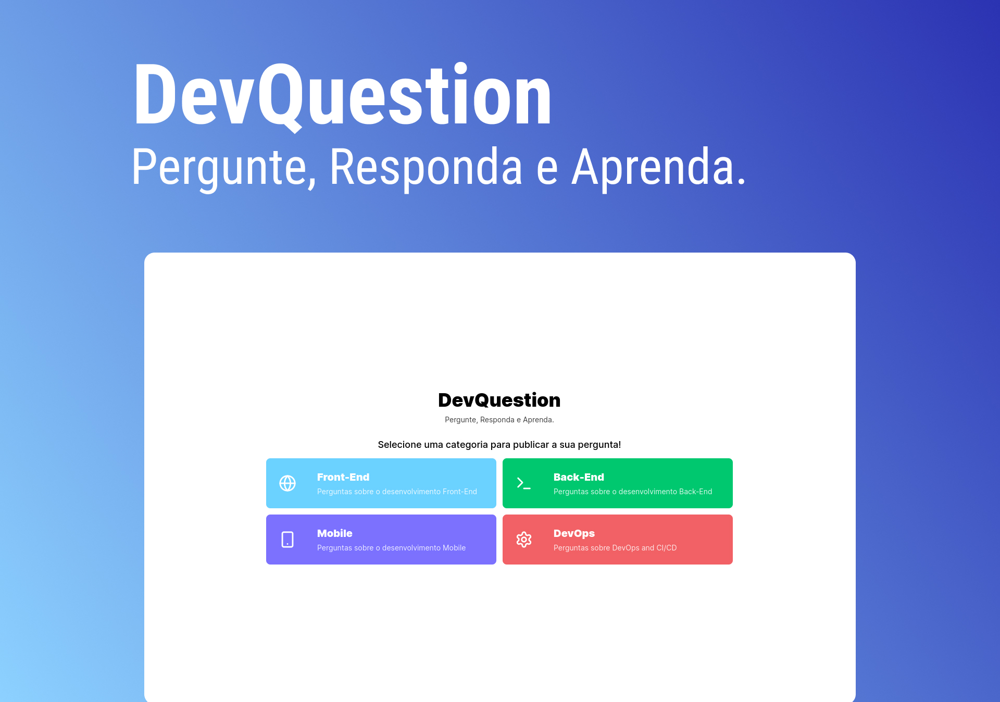

<h1 align="center">DevQuestion</h1>

<p align="center">Explore um ambiente de perguntas e respostas anônimas, aonde você pode fazer perguntas e responder sem revelar a sua identidade.</p>



<p align="center">
  <a href="#-tecnologias">Tecnologias</a>&nbsp;&nbsp;&nbsp;|&nbsp;&nbsp;&nbsp;
  <a href="#memo-licença">Licença</a>
</p>

<p align="center">
  
</p>

## 🚀 Tecnologias

Esse projeto foi desenvolvido com as seguintes tecnologias:

### Front-End

- NextJS
- TailwindCSS
- Tailwind Variants
- Tanstack/react-query
- Radix-UI/React-Dialog
- React-Hook-Form
- Lucide-React
- Date-FNS
- Axios

### Back-End

- BunJS
- ElysiaJS
- Drizzle Orm
- Postgres
- Docker

## 🚀 Etapas para rodar o projeto

Para iniciar o projeto, siga estas etapas:

> Clone o repositório do projeto:

```bash
git clone https://github.com/diovanealves/DevQuestion
```

> Na pasta api deve executar os seguintes comando.

```bash
docker-compose up -d
bun install
bun run dev

# A rota padrão da aplicação e localhost:3001 e para ver a documentação da pagina com o swagger é localhost:3001/swagger
```

> Agora na pasta web executar os seguintes comando.

```bash
npm install
npm run dev

# A rota padrão da aplicação sera localhost:3000
```

<h2 align="center">Autor</h2>
<table>
  <tr>
    <td>
        
            <a href="https://github.com/diovanealves" style="color:#4f46e5" align="center">
                <p>Github</p>
            </a>
            <a href="https://www.linkedin.com/in/diovane-alves-de-oliveira-5320a0217/" style="color:#4f46e5" align="center">
                <p>Linkedin</p>
            </a>
            <a href="https://twitter.com/deluxyfps" style="color:#4f46e5" align="center">
                <p>Twitter</p>
            </a>
    </td>
  </tr>
</table>

## 📝 Licença

Esse projeto está sob a licença MIT.
